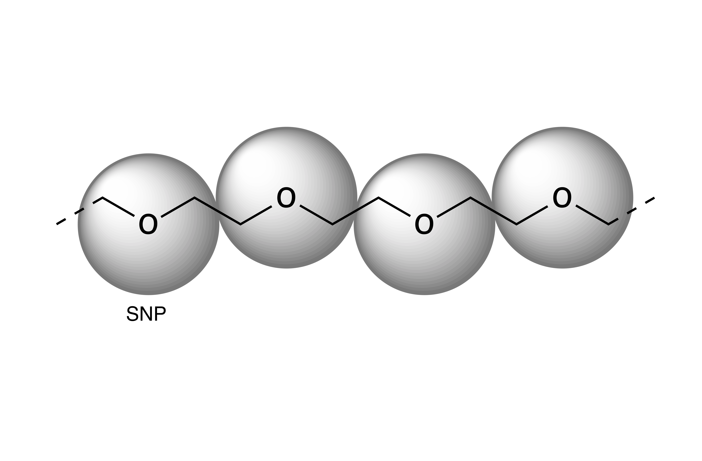

# PEG/PEO Coarse-grained model 
Optimized for protein-polymer interactions

More information:

Ramezanghorbani, Farhad, Ping Lin, and Coray M. Colina. "Optimizing Protein–Polymer Interactions in a Poly (ethylene glycol) Coarse-Grained Model." The Journal of Physical Chemistry B 122, no. 33 (2018): 7997-8005.

http://forcefield-database.org/

